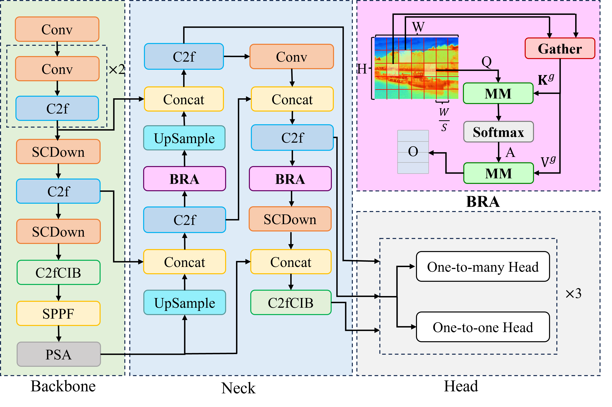
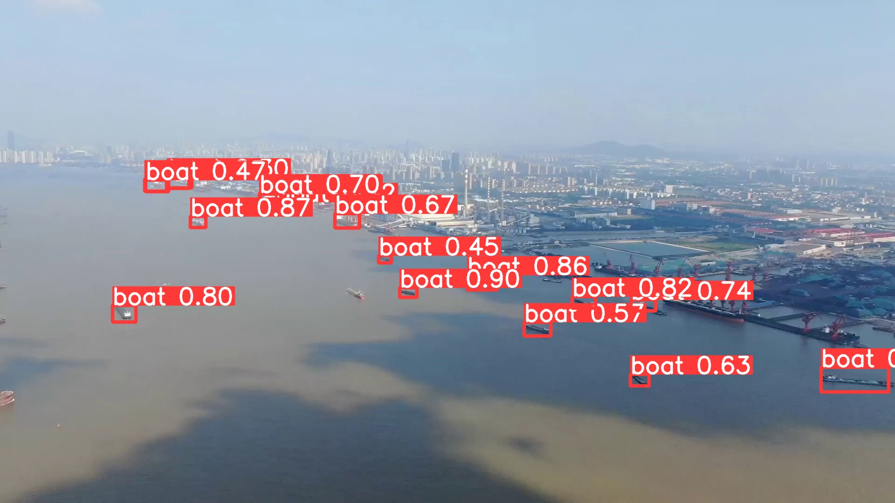
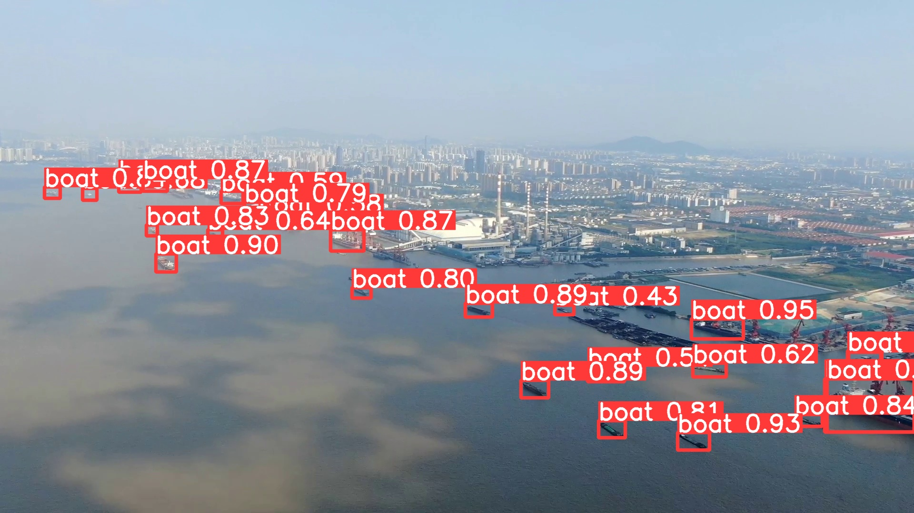

# [Ship Detection in Drone View with Normalized Wasserstein Distance Loss Optimization]


BRA-YOLO network architecture..

<p align="center">
  
   <br>
  BRA-YOLO network architecture..
</p>

Jie Ge, Haiwen Yuan1*, Bulin Zhang, Jiabao Son1, Di Wu, Yanfeng Wang, Xi Gao, Changshi Xiao


<details>
  <summary>
  <font size="+1">Abstract</font>
  </summary>
In the view of drones deployed in maritime surveillance tasks, ships and other maritime objects present small appearance with fewer features, which might seriously fail visual object detection algorithms. Recently attention mechanisms have been studied for small object detection relying on the powerful abilities of feature representation. As the main contribution, a novel attention inspired method is proposed for detecting ships in drone view. First, a Bi-level Routing Attention (BRA) mechanism is introduced to remould the YOLOv10 network. Such a dual-layer routing approach enables more flexible computational resource allocation. Secondly Normalized Wasserstein Distance (NWD) is employed as the loss function, acquiring a good performance on small object detection as well as computational cost. To illustrate it, comprehensive experiments and comparisons with other methods are given in the end. Through the proposed method in real maritime scenarios, the BRA-YOLO model achieved precision (P), recall (R), mAP@0.5, and mAP@0.5:0.95 of 92.6%, 89.1%, 92.9%, and 65.7%, outperforming others.
</details>


## Installation
`conda` virtual environment is recommended. 
```
conda create -n yolov10 python=3.9
conda activate yolov10
pip install -r requirements.txt
pip install -e .
```
## Demo
```
python app.py
# Please visit http://127.0.0.1:7860
```

## Validation
[`yolov10n`](https://huggingface.co/jameslahm/yolov10n)  [`yolov10s`](https://huggingface.co/jameslahm/yolov10s)  [`yolov10m`](https://huggingface.co/jameslahm/yolov10m)  [`yolov10b`](https://huggingface.co/jameslahm/yolov10b)  [`yolov10l`](https://huggingface.co/jameslahm/yolov10l)  [`yolov10x`](https://huggingface.co/jameslahm/yolov10x)  
```
yolo val model=jameslahm/yolov10{n/s/m/b/l/x} data=coco.yaml batch=256
```

Or
```python
from ultralytics import YOLOv10

model = YOLOv10.from_pretrained('jameslahm/yolov10{n/s/m/b/l/x}')
# or
# wget https://github.com/THU-MIG/yolov10/releases/download/v1.1/yolov10{n/s/m/b/l/x}.pt
model = YOLOv10('yolov10{n/s/m/b/l/x}.pt')

model.val(data='coco.yaml', batch=256)
```


## Training 
```
yolo detect train data=coco.yaml model=yolov10n/s/m/b/l/x.yaml epochs=100 batch=16 imgsz=640 device=0,1,2,3,4,5,6,7
```

Or
```python
from ultralytics import YOLOv10

model = YOLOv10()
# If you want to finetune the model with pretrained weights, you could load the 
# pretrained weights like below
# model = YOLOv10.from_pretrained('jameslahm/yolov10{n/s/m/b/l/x}')
# or
# wget https://github.com/THU-MIG/yolov10/releases/download/v1.1/yolov10{n/s/m/b/l/x}.pt
# model = YOLOv10('yolov10{n/s/m/b/l/x}.pt')

model.train(data='coco.yaml', epochs=100, batch=16, imgsz=640)
```


```

## Prediction
```
Note that a smaller confidence threshold can be set to detect smaller objects or objects in the distance. Please refer to [here](https://github.com/THU-MIG/yolov10/issues/136) for details.
```
yolo predict model=jameslahm/yolov10{n/s/m/b/l/x}
```

Or
```python
from ultralytics import YOLOv10

model = YOLOv10.from_pretrained('jameslahm/yolov10{n/s/m/b/l/x}')
# or
# wget https://github.com/THU-MIG/yolov10/releases/download/v1.1/yolov10{n/s/m/b/l/x}.pt
model = YOLOv10('yolov10{n/s/m/b/l/x}.pt')

model.predict()
```

## Export
```
# End-to-End ONNX
yolo export model=jameslahm/yolov10{n/s/m/b/l/x} format=onnx opset=13 simplify
# Predict with ONNX
yolo predict model=yolov10n/s/m/b/l/x.onnx

# End-to-End TensorRT
yolo export model=jameslahm/yolov10{n/s/m/b/l/x} format=engine half=True simplify opset=13 workspace=16
# or
trtexec --onnx=yolov10n/s/m/b/l/x.onnx --saveEngine=yolov10n/s/m/b/l/x.engine --fp16
# Predict with TensorRT
yolo predict model=yolov10n/s/m/b/l/x.engine
```

Or
```python
from ultralytics import YOLOv10

model = YOLOv10.from_pretrained('jameslahm/yolov10{n/s/m/b/l/x}')
# or
# wget https://github.com/THU-MIG/yolov10/releases/download/v1.1/yolov10{n/s/m/b/l/x}.pt
model = YOLOv10('yolov10{n/s/m/b/l/x}.pt')

model.export(...)
```

## Acknowledgement

The code base is built with [ultralytics](https://github.com/ultralytics/ultralytics) and [RT-DETR](https://github.com/lyuwenyu/RT-DETR).

Thanks for the great implementations! 

## result

Visualization Results of the BRA-YOLO Model on ours Dataset.
BRA-YOLO network architecture..

<p align="center">
  
   
   <br>
  
</p>

```
